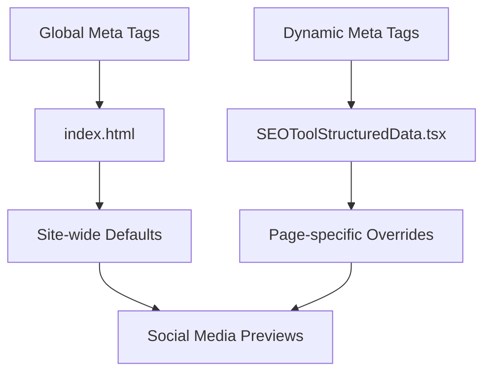

# Meta Tags Implementation Guide

## 🎯 Purpose

Implement comprehensive meta tags for optimal social media sharing, search engine optimization, and user experience across all platforms.

## 🧠 Meta Tags Strategy

### Why Meta Tags Matter
1. **Social Sharing**: Control how content appears on social platforms
2. **Search Snippets**: Influence how pages appear in search results
3. **Browser Behavior**: Control caching, indexing, and rendering
4. **User Experience**: Provide context and improve accessibility

### First Principles Approach
1. **Hierarchy**: Global defaults → Page-specific overrides
2. **Completeness**: Cover all major platforms and use cases
3. **Consistency**: Standardized format across all pages
4. **Performance**: Minimal overhead with maximum impact

## 🏗️ Implementation Architecture

### Two-Tier System



## 📋 Global Meta Tags

**File**: `index.html`
**Scope**: Site-wide defaults

### Basic SEO Meta Tags

```html
<!-- Primary Meta Tags -->
<title>TrendiTools - Discover Trending Tools & Applications</title>
<meta name="title" content="TrendiTools - Discover Trending Tools & Applications">
<meta name="description" content="Discover and explore the latest trending tools and applications. Find productivity tools, design software, development utilities, and more.">
<meta name="keywords" content="tools, applications, productivity, software, trending, discovery, utilities">
<meta name="author" content="TrendiTools">
<meta name="robots" content="index, follow">
<meta name="language" content="English">
<meta name="revisit-after" content="7 days">
```

**Why These Tags**:
- **Title**: Primary heading for search results
- **Description**: Snippet text in search results (155-160 chars)
- **Keywords**: Topic relevance (less important but still useful)
- **Robots**: Explicit crawling instructions
- **Author**: Brand attribution

### Open Graph Meta Tags

```html
<!-- Open Graph / Facebook -->
<meta property="og:type" content="website">
<meta property="og:url" content="https://trenditools.com/">
<meta property="og:title" content="TrendiTools - Discover Trending Tools & Applications">
<meta property="og:description" content="Discover and explore the latest trending tools and applications. Find productivity tools, design software, development utilities, and more.">
<meta property="og:image" content="https://trenditools.com/og-image.jpg">
<meta property="og:image:width" content="1200">
<meta property="og:image:height" content="630">
<meta property="og:site_name" content="TrendiTools">
<meta property="og:locale" content="en_US">
```

**Open Graph Benefits**:
- **Facebook**: Rich previews when shared
- **LinkedIn**: Professional appearance
- **WhatsApp**: Enhanced link previews
- **Slack**: Improved unfurling

**Image Specifications**:
- **Dimensions**: 1200x630px (1.91:1 ratio)
- **Format**: JPG or PNG
- **Size**: Under 8MB
- **Content**: Branded, readable at small sizes

### Twitter Card Meta Tags

```html
<!-- Twitter -->
<meta property="twitter:card" content="summary_large_image">
<meta property="twitter:url" content="https://trenditools.com/">
<meta property="twitter:title" content="TrendiTools - Discover Trending Tools & Applications">
<meta property="twitter:description" content="Discover and explore the latest trending tools and applications. Find productivity tools, design software, development utilities, and more.">
<meta property="twitter:image" content="https://trenditools.com/og-image.jpg">
<meta property="twitter:creator" content="@trenditools">
<meta property="twitter:site" content="@trenditools">
```

**Twitter Card Types**:
- **summary_large_image**: Large image preview (chosen)
- **summary**: Small image preview
- **app**: Mobile app promotion
- **player**: Video/audio content

### Technical Meta Tags

```html
<!-- Technical -->
<meta charset="UTF-8">
<meta name="viewport" content="width=device-width, initial-scale=1.0">
<meta http-equiv="X-UA-Compatible" content="IE=edge">
<meta name="format-detection" content="telephone=no">
<meta name="theme-color" content="#000000">

<!-- Canonical URL -->
<link rel="canonical" href="https://trenditools.com/">

<!-- Favicon -->
<link rel="icon" type="image/svg+xml" href="/vite.svg">
```

## 🔄 Dynamic Meta Tags

**File**: `src/components/SEOToolStructuredData.tsx`
**Scope**: Individual tool pages

### Tool-Specific Implementation

```tsx
export function SEOToolStructuredData({ tool }: ToolStructuredDataProps) {
  const baseUrl = window.location.origin;
  const toolUrl = `${baseUrl}/tool/${tool._id}`;
  const imageUrl = tool.screenshot || `${baseUrl}/default-tool-image.jpg`;

  return (
    <Helmet>
      {/* Primary Meta Tags */}
      <title>{tool.name} - TrendiTools</title>
      <meta name="title" content={`${tool.name} - TrendiTools`} />
      <meta name="description" content={tool.summary} />
      <meta name="keywords" content={tool.tags?.join(", ")} />
      
      {/* Open Graph */}
      <meta property="og:type" content="website" />
      <meta property="og:url" content={toolUrl} />
      <meta property="og:title" content={tool.name} />
      <meta property="og:description" content={tool.summary} />
      <meta property="og:image" content={imageUrl} />
      <meta property="og:image:width" content="1200" />
      <meta property="og:image:height" content="630" />
      <meta property="og:site_name" content="TrendiTools" />
      
      {/* Twitter */}
      <meta name="twitter:card" content="summary_large_image" />
      <meta name="twitter:url" content={toolUrl} />
      <meta name="twitter:title" content={tool.name} />
      <meta name="twitter:description" content={tool.summary} />
      <meta name="twitter:image" content={imageUrl} />
      
      {/* Canonical URL */}
      <link rel="canonical" href={toolUrl} />
      
      {/* Additional SEO */}
      <meta name="robots" content="index, follow" />
      <meta property="article:section" content={tool.category} />
      <meta property="article:tag" content={tool.tags?.join(", ")} />
    </Helmet>
  );
}
```

### Dynamic Content Strategy

**Title Generation**:
```typescript
const generateTitle = (tool: Tool): string => {
  // Format: "Tool Name - TrendiTools"
  return `${tool.name} - TrendiTools`;
};
```

**Description Optimization**:
```typescript
const optimizeDescription = (summary: string): string => {
  // Ensure 150-160 characters for optimal snippet length
  if (summary.length <= 160) return summary;
  
  return summary.substring(0, 157) + '...';
};
```

**Keywords Strategy**:
```typescript
const generateKeywords = (tool: Tool): string => {
  const keywords = [
    tool.name.toLowerCase(),
    tool.category.toLowerCase(),
    ...(tool.tags || []),
    'tool',
    'application',
    'software'
  ];
  
  return keywords.join(', ');
};
```

## 🎨 Social Media Optimization

### Platform-Specific Considerations

#### Facebook/Meta
- **Image Ratio**: 1.91:1 (1200x630)
- **Title Length**: 60 characters
- **Description**: 155 characters
- **Testing**: Facebook Sharing Debugger

#### Twitter/X
- **Card Type**: summary_large_image
- **Image Ratio**: 2:1 (1200x600)
- **Title Length**: 70 characters
- **Description**: 200 characters
- **Testing**: Twitter Card Validator

#### LinkedIn
- **Uses Open Graph**: Same as Facebook
- **Professional Context**: Emphasize business value
- **Image Content**: Clean, professional design

#### WhatsApp
- **Uses Open Graph**: Basic implementation
- **Image Size**: Smaller preview
- **Focus**: Clear, readable thumbnails

### Image Guidelines

**Optimal Specifications**:
```css
/* Social media image requirements */
.og-image {
  width: 1200px;
  height: 630px;
  aspect-ratio: 1.91;
  format: JPEG or PNG;
  size: < 8MB;
  quality: 85%;
}
```

**Content Guidelines**:
1. **Readable Text**: Large, clear fonts
2. **Brand Consistency**: Logo and colors
3. **Tool Context**: Show actual tool interface
4. **Safe Area**: Keep important content in center 80%

## 🔧 Implementation Best Practices

### React Helmet Setup

**Provider Configuration**:
```tsx
// src/main.tsx
import { HelmetProvider } from 'react-helmet-async';

ReactDOM.createRoot(document.getElementById('root')!).render(
  <React.StrictMode>
    <HelmetProvider>
      <ConvexAuthProvider>
        <App />
      </ConvexAuthProvider>
    </HelmetProvider>
  </React.StrictMode>
);
```

**Component Usage**:
```tsx
// In any component
import { Helmet } from 'react-helmet-async';

function ToolPage({ tool }) {
  return (
    <>
      <Helmet>
        <title>{tool.name} - TrendiTools</title>
        <meta name="description" content={tool.summary} />
      </Helmet>
      
      {/* Page content */}
    </>
  );
}
```

### Meta Tag Hierarchy

1. **Global Defaults** (index.html)
2. **Page-Level Overrides** (React Helmet)
3. **Component-Specific** (Individual components)

**Precedence**: Component > Page > Global

### Performance Considerations

**Efficient Updates**:
```tsx
// Only update when tool data changes
const memoizedMetaTags = useMemo(() => {
  return generateMetaTags(tool);
}, [tool.name, tool.summary, tool.screenshot]);
```

**Lazy Loading**:
```tsx
// Load meta tags after critical content
useEffect(() => {
  // Update meta tags after component mount
  updateMetaTags(tool);
}, [tool]);
```

## 🧪 Testing & Validation

### Automated Testing

```javascript
// Meta tag validation
const validateMetaTags = () => {
  const requiredTags = [
    'title',
    'meta[name="description"]',
    'meta[property="og:title"]',
    'meta[property="og:description"]',
    'meta[property="og:image"]',
    'meta[name="twitter:card"]'
  ];
  
  requiredTags.forEach(selector => {
    const element = document.querySelector(selector);
    if (!element) {
      console.error(`Missing required meta tag: ${selector}`);
    }
  });
};
```

### Manual Testing Tools

1. **Facebook Sharing Debugger**: https://developers.facebook.com/tools/debug/
2. **Twitter Card Validator**: https://cards-dev.twitter.com/validator
3. **LinkedIn Post Inspector**: https://www.linkedin.com/post-inspector/
4. **WhatsApp Link Preview**: Send link in WhatsApp

### Browser DevTools

```javascript
// Check current meta tags
const metaTags = Array.from(document.querySelectorAll('meta'))
  .map(tag => ({
    name: tag.name || tag.property,
    content: tag.content
  }))
  .filter(tag => tag.name);

console.table(metaTags);
```

## 📊 Performance Monitoring

### Key Metrics

1. **Social Shares**: Track sharing frequency
2. **Click-Through Rate**: From social platforms
3. **Search Snippets**: Appearance in search results
4. **Page Load Time**: Meta tag processing overhead

### Analytics Integration

```javascript
// Track social sharing
const trackSocialShare = (platform, url) => {
  gtag('event', 'share', {
    method: platform,
    content_type: 'tool',
    item_id: url
  });
};
```

## 🚀 Future Enhancements

### Planned Improvements

1. **Dynamic Images**: Generate tool-specific social images
2. **A/B Testing**: Different meta tag variations
3. **Localization**: Multi-language meta tags
4. **Rich Snippets**: Additional schema markup
5. **Video Previews**: Twitter player cards for demos

### Advanced Features

```tsx
// Dynamic image generation
const generateSocialImage = async (tool: Tool) => {
  const canvas = document.createElement('canvas');
  const ctx = canvas.getContext('2d');
  
  // Generate custom social image with tool info
  // Return image URL
};
```

## 🚨 Common Issues & Solutions

### Troubleshooting

**Issue**: Social platforms show old previews
**Solution**: Clear cache using platform debugging tools

**Issue**: Meta tags not updating
**Solution**: Check React Helmet provider setup

**Issue**: Images not loading in previews
**Solution**: Verify absolute URLs and CORS headers

**Issue**: Duplicate meta tags
**Solution**: Ensure proper Helmet hierarchy

### Debug Checklist

- [ ] All required meta tags present
- [ ] URLs are absolute and accessible
- [ ] Images meet platform specifications
- [ ] No duplicate or conflicting tags
- [ ] React Helmet provider configured
- [ ] Social platform caches cleared

---

*Meta tags implementation follows platform best practices and web standards for optimal social media and search engine compatibility.*