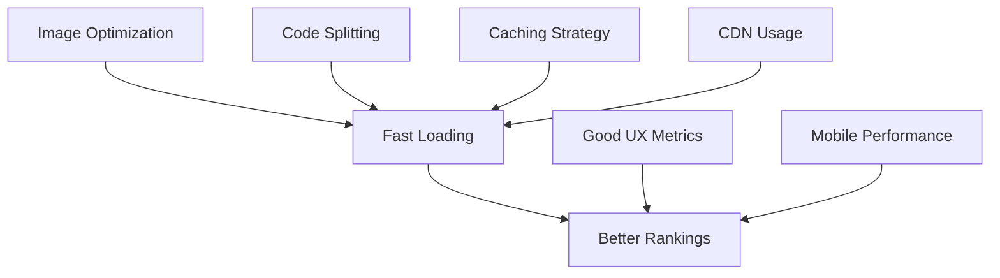

# SEO Performance Optimization Guide

## 🎯 Performance Goals

Optimize TrendiTools for search engine crawling efficiency, user experience, and Core Web Vitals while maintaining SEO effectiveness.

## 📊 Core Web Vitals Impact on SEO

### Google's Page Experience Signals

1. **Largest Contentful Paint (LCP)**: < 2.5s
2. **First Input Delay (FID)**: < 100ms
3. **Cumulative Layout Shift (CLS)**: < 0.1
4. **First Contentful Paint (FCP)**: < 1.8s
5. **Time to Interactive (TTI)**: < 3.8s

### SEO Performance Relationship



## 🖼️ Image Performance Optimization

### Current Implementation

**Enhanced Image URLs**:
```typescript
// src/lib/imageUtils.ts
export function getEnhancedImageUrl(tool: Tool): string {
  if (!tool.screenshot) return '/default-tool-image.jpg';
  
  const slug = generateSlug(tool.name);
  const baseUrl = window.location.origin;
  
  return `${baseUrl}/api/image/${tool._id}/${slug}.jpg`;
}
```

**Benefits**:
- SEO-friendly URLs with tool names
- Consistent image serving
- Better caching headers
- Optimized file formats

### Image Optimization Strategy

#### 1. Format Optimization

```typescript
// Future: WebP with fallback
const getOptimizedImageUrl = (tool: Tool, format: 'webp' | 'jpg' = 'webp') => {
  const slug = generateSlug(tool.name);
  return `/api/image/${tool._id}/${slug}.${format}`;
};

// HTML implementation
<picture>
  <source srcSet={getOptimizedImageUrl(tool, 'webp')} type="image/webp" />
  
</picture>
```

#### 2. Responsive Images

```typescript
// Generate multiple sizes
const generateSrcSet = (tool: Tool) => {
  const slug = generateSlug(tool.name);
  const sizes = [400, 800, 1200, 1600];
  
  return sizes
    .map(size => `/api/image/${tool._id}/${slug}-${size}w.jpg ${size}w`)
    .join(', ');
};

// Usage

```

#### 3. Lazy Loading Implementation

```tsx
// src/components/LazyImage.tsx
import { useState, useRef, useEffect } from 'react';

interface LazyImageProps {
  src: string;
  alt: string;
  className?: string;
  placeholder?: string;
}

export function LazyImage({ src, alt, className, placeholder }: LazyImageProps) {
  const [isLoaded, setIsLoaded] = useState(false);
  const [isInView, setIsInView] = useState(false);
  const imgRef = useRef<HTMLImageElement>(null);

  useEffect(() => {
    const observer = new IntersectionObserver(
      ([entry]) => {
        if (entry.isIntersecting) {
          setIsInView(true);
          observer.disconnect();
        }
      },
      { threshold: 0.1 }
    );

    if (imgRef.current) {
      observer.observe(imgRef.current);
    }

    return () => observer.disconnect();
  }, []);

  return (
    <div ref={imgRef} className={className}>
      {isInView && (
         setIsLoaded(true)}
          style={{
            opacity: isLoaded ? 1 : 0,
            transition: 'opacity 0.3s ease'
          }}
        />
      )}
      {!isLoaded && placeholder && (
        <div className="placeholder">{placeholder}</div>
      )}
    </div>
  );
}
```

## 🚀 Code Splitting & Bundle Optimization

### Route-Based Code Splitting

```tsx
// src/App.tsx
import { lazy, Suspense } from 'react';
import { Routes, Route } from 'react-router-dom';

// Lazy load components
const HomePage = lazy(() => import('./pages/HomePage'));
const ToolPage = lazy(() => import('./components/ToolPage'));
const SearchPage = lazy(() => import('./pages/SearchPage'));

function App() {
  return (
    <Suspense fallback={<div>Loading...</div>}>
      <Routes>
        <Route path="/" element={<HomePage />} />
        <Route path="/tool/:id" element={<ToolPage />} />
        <Route path="/search" element={<SearchPage />} />
      </Routes>
    </Suspense>
  );
}
```

### Component-Level Code Splitting

```tsx
// Heavy components loaded on demand
const HeavyAnalytics = lazy(() => import('./HeavyAnalytics'));
const AdvancedFilters = lazy(() => import('./AdvancedFilters'));

// Conditional loading
function ToolPage({ tool }: { tool: Tool }) {
  const [showAnalytics, setShowAnalytics] = useState(false);
  
  return (
    <div>
      <ToolHeader tool={tool} />
      <ToolContent tool={tool} />
      
      {showAnalytics && (
        <Suspense fallback={<div>Loading analytics...</div>}>
          <HeavyAnalytics tool={tool} />
        </Suspense>
      )}
    </div>
  );
}
```

## 💾 Caching Strategy

### Browser Caching Headers

```typescript
// Convex HTTP action for images
export const serveImage = httpAction(async (ctx, request) => {
  const { toolId, filename } = ctx.params;
  
  // Get image data
  const imageData = await getImageData(toolId);
  
  return new Response(imageData, {
    headers: {
      'Content-Type': 'image/jpeg',
      'Cache-Control': 'public, max-age=31536000, immutable', // 1 year
      'ETag': generateETag(imageData),
      'Last-Modified': new Date().toUTCString(),
      'Vary': 'Accept-Encoding'
    }
  });
});
```

### Service Worker Implementation

```javascript
// public/sw.js
const CACHE_NAME = 'trenditools-v1';
const STATIC_ASSETS = [
  '/',
  '/manifest.json',
  '/default-tool-image.jpg'
];

// Cache strategies
self.addEventListener('fetch', event => {
  const { request } = event;
  const url = new URL(request.url);
  
  // Cache images aggressively
  if (url.pathname.startsWith('/api/image/')) {
    event.respondWith(
      caches.open(CACHE_NAME).then(cache => {
        return cache.match(request).then(response => {
          if (response) return response;
          
          return fetch(request).then(fetchResponse => {
            cache.put(request, fetchResponse.clone());
            return fetchResponse;
          });
        });
      })
    );
  }
});
```

### React Query Caching

```tsx
// src/hooks/useTools.ts
import { useQuery } from '@tanstack/react-query';

export function useTools() {
  return useQuery({
    queryKey: ['tools'],
    queryFn: fetchTools,
    staleTime: 5 * 60 * 1000, // 5 minutes
    cacheTime: 30 * 60 * 1000, // 30 minutes
    refetchOnWindowFocus: false
  });
}

export function useTool(toolId: string) {
  return useQuery({
    queryKey: ['tool', toolId],
    queryFn: () => fetchTool(toolId),
    staleTime: 10 * 60 * 1000, // 10 minutes
    cacheTime: 60 * 60 * 1000, // 1 hour
    enabled: !!toolId
  });
}
```

## 🔍 Search Performance

### Database Query Optimization

```typescript
// convex/tools.ts - Optimized queries
export const getToolsWithImages = query({
  args: { 
    limit: v.optional(v.number()),
    category: v.optional(v.string())
  },
  handler: async (ctx, args) => {
    const limit = args.limit ?? 20;
    
    // Use index for better performance
    let query = ctx.db.query('tools')
      .withIndex('by_category_created', q => 
        args.category ? q.eq('category', args.category) : q
      )
      .order('desc')
      .take(limit);
    
    const tools = await query;
    
    // Batch process image URLs
    return tools.map(tool => ({
      ...tool,
      enhancedImageUrl: getEnhancedImageUrl(tool)
    }));
  }
});
```

### Search Index Optimization

```typescript
// Enhanced search with performance
export const searchTools = query({
  args: { 
    query: v.string(),
    limit: v.optional(v.number())
  },
  handler: async (ctx, args) => {
    const limit = args.limit ?? 10;
    
    // Use text search index
    const results = await ctx.db
      .query('tools')
      .withSearchIndex('search_tools', q => 
        q.search('name', args.query)
         .search('summary', args.query)
         .search('tags', args.query)
      )
      .take(limit);
    
    return results;
  }
});
```

## 📱 Mobile Performance

### Responsive Design Performance

```css
/* Optimized CSS for mobile */
.tool-grid {
  display: grid;
  grid-template-columns: repeat(auto-fill, minmax(300px, 1fr));
  gap: 1rem;
  
  /* Use transform for better performance */
  will-change: transform;
}

.tool-card {
  /* Hardware acceleration */
  transform: translateZ(0);
  
  /* Optimize animations */
  transition: transform 0.2s ease;
}

.tool-card:hover {
  transform: translateY(-4px) translateZ(0);
}

/* Mobile optimizations */
@media (max-width: 768px) {
  .tool-grid {
    grid-template-columns: 1fr;
    gap: 0.5rem;
  }
  
  .tool-card {
    /* Disable hover effects on mobile */
    transition: none;
  }
}
```

### Touch Performance

```tsx
// Optimized touch interactions
function ToolCard({ tool }: { tool: Tool }) {
  const [isPressed, setIsPressed] = useState(false);
  
  const handleTouchStart = useCallback(() => {
    setIsPressed(true);
  }, []);
  
  const handleTouchEnd = useCallback(() => {
    setIsPressed(false);
  }, []);
  
  return (
    <div
      className={`tool-card ${isPressed ? 'pressed' : ''}`}
      onTouchStart={handleTouchStart}
      onTouchEnd={handleTouchEnd}
      style={{
        // Use transform for better performance
        transform: isPressed ? 'scale(0.98)' : 'scale(1)'
      }}
    >
      {/* Card content */}
    </div>
  );
}
```

## 🎨 CSS Performance

### Critical CSS Inlining

```html
<!-- index.html -->
<style>
  /* Critical above-the-fold styles */
  body {
    margin: 0;
    font-family: -apple-system, BlinkMacSystemFont, 'Segoe UI', sans-serif;
    background: #ffffff;
  }
  
  .header {
    height: 60px;
    background: #000;
    color: #fff;
  }
  
  .loading {
    display: flex;
    justify-content: center;
    align-items: center;
    height: 200px;
  }
</style>
```

### CSS Optimization

```css
/* Use efficient selectors */
.tool-card { /* Good: class selector */ }
#header { /* Good: ID selector */ }

/* Avoid expensive selectors */
/* Bad: * { } */
/* Bad: div > div > div { } */
/* Bad: [attribute*="value"] { } */

/* Optimize animations */
@keyframes fadeIn {
  from { opacity: 0; transform: translateY(20px); }
  to { opacity: 1; transform: translateY(0); }
}

.fade-in {
  animation: fadeIn 0.3s ease-out;
  /* Use transform and opacity for better performance */
}
```

## 📊 Performance Monitoring

### Web Vitals Tracking

```typescript
// src/utils/webVitals.ts
import { getCLS, getFID, getFCP, getLCP, getTTFB } from 'web-vitals';

function sendToAnalytics(metric: any) {
  // Send to your analytics service
  gtag('event', metric.name, {
    value: Math.round(metric.name === 'CLS' ? metric.value * 1000 : metric.value),
    event_category: 'Web Vitals',
    event_label: metric.id,
    non_interaction: true
  });
}

export function trackWebVitals() {
  getCLS(sendToAnalytics);
  getFID(sendToAnalytics);
  getFCP(sendToAnalytics);
  getLCP(sendToAnalytics);
  getTTFB(sendToAnalytics);
}
```

### Performance Budget

```json
// performance-budget.json
{
  "budget": [
    {
      "path": "/**",
      "timings": [
        {
          "metric": "first-contentful-paint",
          "budget": 2000
        },
        {
          "metric": "largest-contentful-paint",
          "budget": 2500
        },
        {
          "metric": "cumulative-layout-shift",
          "budget": 0.1
        }
      ],
      "resourceSizes": [
        {
          "resourceType": "script",
          "budget": 400
        },
        {
          "resourceType": "image",
          "budget": 1000
        },
        {
          "resourceType": "total",
          "budget": 2000
        }
      ]
    }
  ]
}
```

## 🛠️ Build Optimization

### Vite Configuration

```typescript
// vite.config.ts
import { defineConfig } from 'vite';
import react from '@vitejs/plugin-react';
import { visualizer } from 'rollup-plugin-visualizer';

export default defineConfig({
  plugins: [
    react(),
    visualizer({
      filename: 'dist/stats.html',
      open: true
    })
  ],
  build: {
    rollupOptions: {
      output: {
        manualChunks: {
          vendor: ['react', 'react-dom'],
          convex: ['convex/react'],
          ui: ['@radix-ui/react-dialog', '@radix-ui/react-dropdown-menu']
        }
      }
    },
    chunkSizeWarningLimit: 1000,
    sourcemap: false, // Disable in production
    minify: 'terser',
    terserOptions: {
      compress: {
        drop_console: true,
        drop_debugger: true
      }
    }
  },
  server: {
    hmr: {
      overlay: false
    }
  }
});
```

### Tree Shaking Optimization

```typescript
// Import only what you need
// Bad
import * as React from 'react';
import _ from 'lodash';

// Good
import { useState, useEffect } from 'react';
import { debounce } from 'lodash-es';

// Use ES modules
import { format } from 'date-fns/format';
import { parseISO } from 'date-fns/parseISO';
```

## 🔧 Development Tools

### Performance Profiling

```tsx
// React Profiler for development
import { Profiler } from 'react';

function onRenderCallback(id: string, phase: string, actualDuration: number) {
  if (process.env.NODE_ENV === 'development') {
    console.log('Profiler:', { id, phase, actualDuration });
  }
}

function App() {
  return (
    <Profiler id="App" onRender={onRenderCallback}>
      <Router>
        <Routes>
          {/* Your routes */}
        </Routes>
      </Router>
    </Profiler>
  );
}
```

### Bundle Analysis

```bash
# Analyze bundle size
npm run build
npx vite-bundle-analyzer dist

# Check for duplicate dependencies
npx duplicate-package-checker-webpack-plugin

# Lighthouse CI
npm install -g @lhci/cli
lhci autorun
```

## 📈 Performance Metrics

### Key Performance Indicators

1. **Page Load Time**: < 3 seconds
2. **Time to Interactive**: < 5 seconds
3. **Bundle Size**: < 500KB (gzipped)
4. **Image Load Time**: < 2 seconds
5. **Search Response Time**: < 500ms

### Monitoring Dashboard

```typescript
// Performance monitoring
const performanceMetrics = {
  pageLoadTime: performance.timing.loadEventEnd - performance.timing.navigationStart,
  domContentLoaded: performance.timing.domContentLoadedEventEnd - performance.timing.navigationStart,
  firstPaint: performance.getEntriesByType('paint')[0]?.startTime,
  firstContentfulPaint: performance.getEntriesByType('paint')[1]?.startTime
};

// Send to monitoring service
fetch('/api/metrics', {
  method: 'POST',
  body: JSON.stringify(performanceMetrics)
});
```

## 🚀 Future Optimizations

### Planned Improvements

1. **Edge Computing**: Deploy to CDN edge locations
2. **Image CDN**: Dedicated image optimization service
3. **Progressive Web App**: Service worker caching
4. **HTTP/3**: Latest protocol support
5. **Preloading**: Critical resource hints

### Advanced Techniques

```typescript
// Resource hints
const preloadCriticalResources = () => {
  const link = document.createElement('link');
  link.rel = 'preload';
  link.href = '/api/tools/popular';
  link.as = 'fetch';
  link.crossOrigin = 'anonymous';
  document.head.appendChild(link);
};

// Intersection Observer for lazy loading
const observeImages = () => {
  const imageObserver = new IntersectionObserver((entries) => {
    entries.forEach(entry => {
      if (entry.isIntersecting) {
        const img = entry.target as HTMLImageElement;
        img.src = img.dataset.src!;
        img.classList.remove('lazy');
        imageObserver.unobserve(img);
      }
    });
  });
  
  document.querySelectorAll('img[data-src]').forEach(img => {
    imageObserver.observe(img);
  });
};
```

---

*Performance optimization is an ongoing process. Regular monitoring and testing ensure optimal user experience and search engine rankings.*