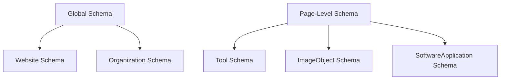

# Structured Data Implementation Guide

## 🎯 Purpose

Implement JSON-LD structured data to help search engines understand our content and enable rich snippets in search results.

## 🧠 Why Structured Data Matters

### Search Engine Benefits
1. **Rich Snippets**: Enhanced search results with additional information
2. **Knowledge Graph**: Potential inclusion in Google's knowledge panels
3. **Voice Search**: Better compatibility with voice assistants
4. **Featured Snippets**: Increased chances of appearing in position zero

### Business Benefits
1. **Higher CTR**: Rich snippets attract more clicks
2. **Brand Authority**: Professional appearance in search results
3. **Competitive Edge**: Most competitors lack proper structured data
4. **Future-Proofing**: Prepared for evolving search features

## 🏗️ Implementation Architecture

### Two-Layer Approach



### 1. Global Structured Data

**File**: `index.html`
**Scope**: Site-wide information

```json
{
  "@context": "https://schema.org",
  "@type": "WebSite",
  "name": "TrendiTools",
  "description": "Discover and explore the latest trending tools and applications",
  "url": "https://trenditools.com",
  "potentialAction": {
    "@type": "SearchAction",
    "target": {
      "@type": "EntryPoint",
      "urlTemplate": "https://trenditools.com/search?q={search_term_string}"
    },
    "query-input": "required name=search_term_string"
  },
  "publisher": {
    "@type": "Organization",
    "name": "TrendiTools",
    "url": "https://trenditools.com"
  }
}
```

**Why This Schema**:
- **WebSite Type**: Identifies the site to search engines
- **SearchAction**: Enables site search box in Google results
- **Publisher Info**: Establishes brand authority
- **Potential Action**: Defines how users can interact with the site

### 2. Dynamic Tool Structured Data

**File**: `src/components/SEOToolStructuredData.tsx`
**Scope**: Individual tool pages

```typescript
interface ToolStructuredDataProps {
  tool: {
    _id: string;
    name: string;
    tagline: string;
    summary: string;
    url: string;
    category: string;
    screenshot?: string;
    tags?: string[];
  };
}

const generateStructuredData = (tool: ToolStructuredDataProps['tool']) => {
  const baseUrl = window.location.origin;
  
  return {
    "@context": "https://schema.org",
    "@type": "SoftwareApplication",
    "name": tool.name,
    "description": tool.summary,
    "url": tool.url,
    "applicationCategory": tool.category,
    "operatingSystem": "Web Browser",
    "offers": {
      "@type": "Offer",
      "price": "0",
      "priceCurrency": "USD"
    },
    "image": tool.screenshot ? {
      "@type": "ImageObject",
      "url": tool.screenshot,
      "description": `Screenshot of ${tool.name}`,
      "width": 1200,
      "height": 630
    } : undefined,
    "keywords": tool.tags?.join(", "),
    "publisher": {
      "@type": "Organization",
      "name": "TrendiTools",
      "url": baseUrl
    }
  };
};
```

## 📋 Schema Types Explained

### SoftwareApplication Schema

**Why This Type**:
- **Accurate Representation**: Tools are software applications
- **Rich Properties**: Supports categories, pricing, images
- **Search Features**: Enables app-specific search features
- **Mobile Optimization**: Works well with mobile search

**Key Properties**:
- `name`: Tool name for identification
- `description`: Summary for search snippets
- `applicationCategory`: Helps with categorization
- `offers`: Pricing information (free in our case)
- `image`: Screenshot for visual search
- `keywords`: Tags for topic relevance

### ImageObject Schema

```json
{
  "@type": "ImageObject",
  "url": "https://trenditools.com/images/notion-productivity-tool-abc123.jpg",
  "description": "Screenshot of Notion productivity tool interface",
  "width": 1200,
  "height": 630,
  "encodingFormat": "image/jpeg"
}
```

**Benefits**:
- **Image Search**: Better indexing in Google Images
- **Rich Results**: Images appear in search snippets
- **Social Sharing**: Proper image metadata for social platforms
- **Accessibility**: Structured description for screen readers

### WebSite Schema with SearchAction

```json
{
  "@type": "WebSite",
  "potentialAction": {
    "@type": "SearchAction",
    "target": {
      "@type": "EntryPoint",
      "urlTemplate": "https://trenditools.com/search?q={search_term_string}"
    },
    "query-input": "required name=search_term_string"
  }
}
```

**Result**: Google may show a search box directly in search results

## 🔧 Implementation Details

### React Helmet Integration

**File**: `src/components/SEOToolStructuredData.tsx`

```tsx
import { Helmet } from 'react-helmet-async';

export function SEOToolStructuredData({ tool }: ToolStructuredDataProps) {
  const structuredData = generateStructuredData(tool);
  const baseUrl = window.location.origin;
  const toolUrl = `${baseUrl}/tool/${tool._id}`;

  return (
    <Helmet>
      {/* Structured Data */}
      <script type="application/ld+json">
        {JSON.stringify(structuredData, null, 2)}
      </script>
      
      {/* Meta Tags */}
      <title>{tool.name} - TrendiTools</title>
      <meta name="description" content={tool.summary} />
      <meta name="keywords" content={tool.tags?.join(", ")} />
      
      {/* Open Graph */}
      <meta property="og:title" content={tool.name} />
      <meta property="og:description" content={tool.summary} />
      <meta property="og:url" content={toolUrl} />
      <meta property="og:type" content="website" />
      {tool.screenshot && (
        <meta property="og:image" content={tool.screenshot} />
      )}
      
      {/* Twitter Cards */}
      <meta name="twitter:card" content="summary_large_image" />
      <meta name="twitter:title" content={tool.name} />
      <meta name="twitter:description" content={tool.summary} />
      {tool.screenshot && (
        <meta name="twitter:image" content={tool.screenshot} />
      )}
      
      {/* Canonical URL */}
      <link rel="canonical" href={toolUrl} />
    </Helmet>
  );
}
```

### Provider Setup

**File**: `src/main.tsx`

```tsx
import { HelmetProvider } from 'react-helmet-async';

ReactDOM.createRoot(document.getElementById('root')!).render(
  <React.StrictMode>
    <HelmetProvider>
      <ConvexAuthProvider>
        <App />
      </ConvexAuthProvider>
    </HelmetProvider>
  </React.StrictMode>
);
```

**Why HelmetProvider**:
- **SSR Compatibility**: Works with server-side rendering
- **Async Support**: Handles dynamic content loading
- **Deduplication**: Prevents duplicate meta tags
- **Performance**: Efficient DOM updates

## 🧪 Testing & Validation

### Google's Rich Results Test

```bash
# Test URL
https://search.google.com/test/rich-results

# Test specific tool page
https://search.google.com/test/rich-results?url=https://trenditools.com/tool/123
```

### Schema Markup Validator

```bash
# Alternative validator
https://validator.schema.org/

# JSON-LD Playground
https://json-ld.org/playground/
```

### Browser Console Testing

```javascript
// Check if structured data is present
console.log(
  Array.from(document.querySelectorAll('script[type="application/ld+json"]'))
    .map(script => JSON.parse(script.textContent))
);

// Validate schema structure
const schemas = Array.from(document.querySelectorAll('script[type="application/ld+json"]'));
schemas.forEach((script, index) => {
  try {
    const data = JSON.parse(script.textContent);
    console.log(`Schema ${index + 1}:`, data);
  } catch (e) {
    console.error(`Invalid JSON in schema ${index + 1}:`, e);
  }
});
```

## 📊 Expected Rich Results

### Software Application Rich Results

**Potential Features**:
- App name and description
- Category and pricing
- User ratings (when implemented)
- Download/visit buttons
- Screenshots in image carousel

### Image Rich Results

**Features**:
- Tool screenshots in Google Images
- Proper attribution and context
- Click-through to tool pages
- Related image suggestions

### Site Search Box

**Feature**: Direct search box in Google results
**Requirements**: 
- Valid SearchAction schema
- Functional search endpoint
- Consistent search URL structure

## 🔄 Maintenance & Updates

### Regular Checks

1. **Monthly**: Validate structured data with Google's tools
2. **Quarterly**: Review and update schema properties
3. **After Updates**: Test new tool additions
4. **Performance**: Monitor rich result appearance

### Schema Evolution

```typescript
// Version tracking for schema updates
const SCHEMA_VERSION = "1.0";

const generateStructuredData = (tool: Tool) => {
  return {
    "@context": "https://schema.org",
    "@type": "SoftwareApplication",
    // ... schema properties
    "version": SCHEMA_VERSION,
    "dateModified": new Date().toISOString()
  };
};
```

### Future Enhancements

1. **Review Schema**: Add user ratings and reviews
2. **FAQ Schema**: Common questions about tools
3. **BreadcrumbList**: Navigation structure
4. **Organization**: Detailed company information
5. **Event Schema**: Tool launches and updates

## 🚨 Common Pitfalls

### Avoid These Mistakes

1. **Invalid JSON**: Always validate JSON syntax
2. **Missing Required Properties**: Check schema.org requirements
3. **Inconsistent Data**: Ensure structured data matches page content
4. **Duplicate Schemas**: Don't repeat the same schema type
5. **Outdated Properties**: Keep up with schema.org updates

### Debug Checklist

- [ ] JSON syntax is valid
- [ ] Required properties are present
- [ ] URLs are absolute and accessible
- [ ] Images have proper dimensions
- [ ] Schema type matches content
- [ ] No conflicting meta tags

---

*Structured data implementation follows schema.org standards and Google's guidelines for maximum compatibility and effectiveness.*